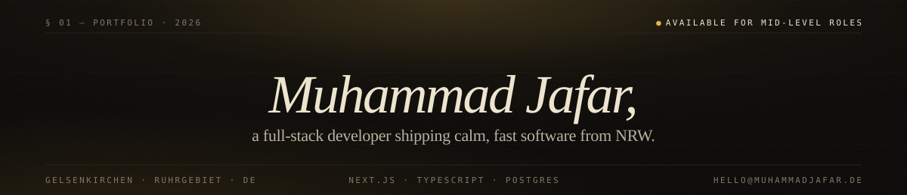

<p align="center">
  <a href="https://muhammadjafar.de"><b>muhammadjafar.de</b></a> &nbsp;·&nbsp;
  <a href="mailto:hello@muhammadjafar.de">hello@muhammadjafar.de</a> &nbsp;·&nbsp;
  <a href="https://linkedin.com/in/muhammadjafar01">LinkedIn</a>
</p>

---

I'm a full-stack developer based in **Gelsenkirchen, in the Ruhrgebiet (NRW)**. I build fast, maintainable web applications with Next.js, TypeScript, and PostgreSQL — from clean React interfaces down to Postgres query plans.

Currently shipping at **[axess Intelligence](https://www.axess-intelligence.com)** in Cologne: owning the company's Next.js platform, tuning SQL across PostgreSQL and MySQL, and keeping CI/CD on Vercel humming. Before that, I led a legacy PHP → React/Node.js migration with a 45% improvement in page load times.

### § Currently

```text
shipping    —  axess Intelligence · Next.js platform (Drizzle · Neon · Vercel)
studying    —  M.Sc. International Software Systems Science, Uni Bamberg
sharpening  —  Server Components · Rust · Observability
```

### § Stack I reach for

| Layer        | Tools                                                              |
| ------------ | ------------------------------------------------------------------ |
| **Frontend** | React · Next.js · TypeScript · Tailwind · Flutter                  |
| **Backend**  | Node.js · Server Actions · Python · FastAPI · NestJS · GraphQL     |
| **Data**     | PostgreSQL · MySQL · Drizzle · Neon · Redis · SQLite               |
| **Delivery** | Vercel · GitHub Actions · Docker · Google Cloud                    |
| **Workflow** | Agile · Jira · Figma · Code review · Dagster · OpenAI API          |

### § How I work

> **Performance is a feature.** Types are documentation that can't go stale.
> Small PRs, short feedback loops. Write it once, well.

### § Reach me

Open to **mid-level full-stack roles** — on-site in NRW (Köln · Düsseldorf · Ruhrgebiet) or remote across the EU. Usually reply within 24 hours on weekdays.

Also speaks: English (fluent) · German (conversational, improving) · Urdu (native).

---

<p align="center">
  
  
</p>

<p align="center">
  
</p>

---

<p align="center">
  <sub>Set in Instrument Serif &amp; JetBrains Mono. Built in NRW.</sub>
</p>
